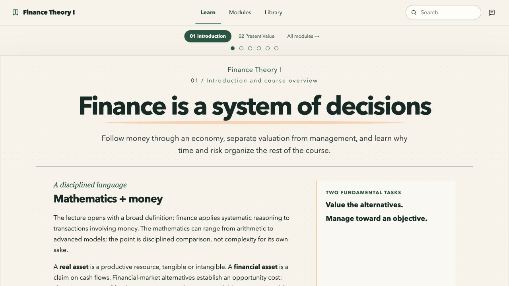
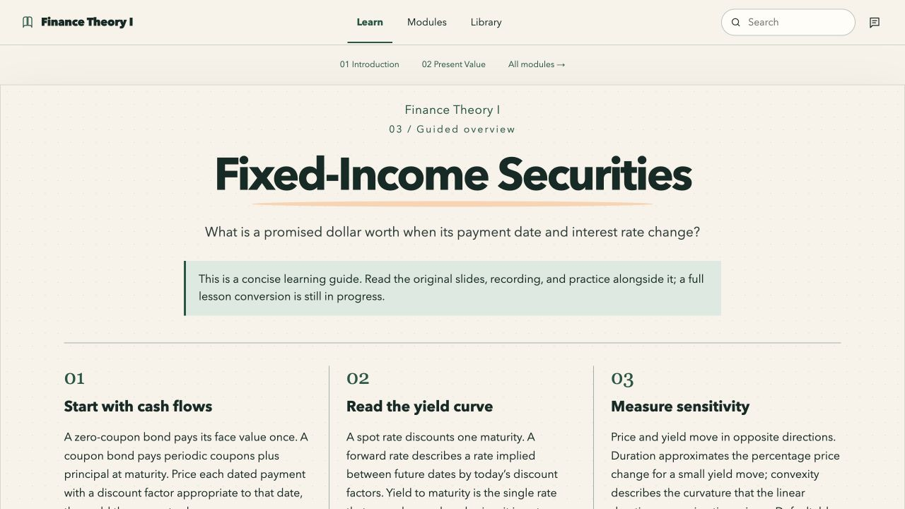

# Finance Theory Notebook

An illustrated, local-first companion to [MIT OpenCourseWare 15.401 Finance Theory I (Fall 2008)](https://ocw.mit.edu/courses/15-401-finance-theory-i-fall-2008/), taught by Andrew W. Lo. Explore finance concepts in a browser, keep the original materials close, and save study notes on your own computer.



## Start the course

You need Node.js and pnpm. Clone the repository, then run:

```sh
cd local-course
pnpm install --frozen-lockfile
./start-course.sh
```

Open **http://127.0.0.1:4173/**. On macOS, `local-course/Start Course.command` also launches the course after dependencies are installed. The app runs on localhost and stores notes and progress in your browser. Clearing browser site data removes them.

## What you can study today

| Modules | Experience | Coverage |
| --- | --- | --- |
| 01 Introduction | Authored notebook lesson | Diagrams, price-discovery activity, comprehension check, local lecture and source anchors |
| 02 Present Value | Authored pilot lesson | Interactive cash-flow timeline, worked calculations, hints, local lecture, and links to all 35 original problems |
| 03–12 | Guided overviews | Core ideas, a formula or model, a worked example, self-check prompt, and links to original slides and practice |

The course navigation covers all 12 modules. **The modernized course is still in progress.** The guided overviews are starting points, not complete replacements for the lectures, recitations, problems, or exams. See the [course build plan](course-audit/BUILD-PLAN.md) and [source audit](course-audit/REPORT.md) for the full completion criteria and source inventory.

| Present Value lab | Fixed-Income guide |
| --- | --- |
|  |  |

## Original MIT materials

The repository preserves the downloaded OCW site and course files. The app’s **Library** gives local access to 49 distinct PDFs, including lecture slides, recitations, transcripts, the 136 numbered problems and solutions, practice exams, and review decks. The source map also includes the 20 lecture sessions and instructor interview. The audit records how duplicate assets were reconciled.

The large MP4 recordings are excluded from Git. To restore them after cloning, from the repository root:

```sh
python3 -m venv local-course/.tools/venv
local-course/.tools/venv/bin/pip install imageio-ffmpeg
local-course/.tools/venv/bin/python local-course/scripts/download_media.py
```

Allow roughly 3.55 GB and see the [media notes](local-course/public/media/README.md) for provenance and verification details. The online lecture links remain available in the module list. The commercial textbooks referenced by the original course and the standalone Acid Rain case handout are not included.

## Repository map

- [`local-course/`](local-course/) — React course, source library, media manifest, launcher, and tests.
- [`course-audit/`](course-audit/) — source inventory, extracted text, coverage review, and build plan.
- [`pages/`](pages/), [`resources/`](resources/), [`static_resources/`](static_resources/) — preserved OCW site archive.

To validate the current app, run `pnpm test` and `pnpm run build` in `local-course/`.

## Credits and reuse

Original course materials are credited to MIT OpenCourseWare, Andrew W. Lo, and the credited course contributors. Their original notices and [MIT OCW terms](https://ocw.mit.edu/pages/privacy-and-terms-of-use/) apply, including attribution, noncommercial use, and share-alike conditions for adapted course material. See [course content and attribution](CONTENT-LICENSE.md) for the reuse details. The new explanations, examples, and interface are independent adaptations for study; MIT has not endorsed this project. The screenshots above show the local app, not an official MIT product.
